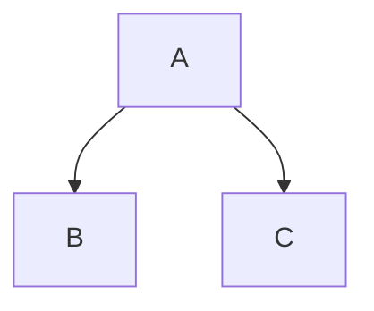

# Lowest hanging fruit of TeXmacs greatness for VSCode

An extension to directly WYSIWYG-style edit equations, with rendering through KaTeX, and key bindings.

The high-bar ideal is to approach the usability of TeXmacs. So eg. we will use more braces than necessary for rendering, to keep track of the structure of formulas. The key bindings will be strictly compatible with [Navi Parens](https://marketplace.visualstudio.com/items?itemName=lukstafi.navi-parens), and compatible with TeXmacs where that is also most ergonomic.

Two extensions that look relevant:
- [Fast Unicode Math Characters](https://marketplace.visualstudio.com/items?itemName=GuidoTapia2.unicode-math-vscode&ssr=false#overview)
- [Ultra Math Preview](https://marketplace.visualstudio.com/items?itemName=yfzhao.ultra-math-preview)

Okay, the action plan!
- Intercept the communication in the markdown preview, and add LaTeX code to render the cursor and a thin box around the nearest braces encompassing the cursor.
  - The actual cursor and edit actions happen in the code pane, but user's focus is in the preview pane.
- Add snippets, keybindings for the snippets commands.
- Add a command to cycle through alternatives of what's to the left of the cursor. Maybe don't bind it to tab (a la TeXmacs), as it might conflict with other uses.
    - E.g. $S$ -> $\Sigma$ -> $\sum$ -> $S$; $P$ -> $\Pi$ -> $\prod$ -> $P$; $f$ -> $\phi$ -> $\varphi$ -> $f$...
- Add context-sensitive commands to extend the object at cursor to the right, bottom, left and up. In particular, it should work with tables (builtin markdown), and trees.
  - And also table and tree specific command "delete row", and table-specific "delete column".
- Find out what markdown plugin is best for the tree objects -- seems it's best to use [Mermaid](http://mermaid.js.org/#/). It doesn't render on GitHub, but there's:
  - [a PanDoc filter](https://github.com/raghur/mermaid-filter)
  - [a VS Code extension](https://github.com/mjbvz/vscode-markdown-mermaid)

And the name: `vsc-markmacs`

## P.S. 2023-11-23 -- LaTeX-aware navigation for v1.3, WYSIWYG for v2.0

My initial idea of just using the preview hasn't panned out because the burden on editing is just too great: in particular, the edits land in the undo ring, breaking the undo command. On the bright side, I fixed issues with multicharacter delimiters, added skipping delimiters for navigation to previous / next character, added an alternative to previous / next line that always stops at a delimiter, and provided a nice set of LaTeX-specific delimiters and separators. This is lots of features that merit a v1.3 release.

The plan is to work on a full-fledged WYSIWYG editor for Markdown+KaTeX+Mermaid, along the original plan of a poor man's TeXmacs replacement. Once I have some spare time; as Navi Parens v2. That is, I will fork a Markdown preview extension to implement the cursor marking and nearest scope highlighting; while the actual editing still happening in a regular Markdown editing window. Implementing a custom editor would make it (maybe) too hard to ensure all editing features work.
