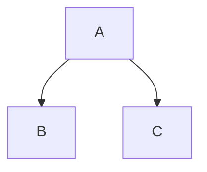

# Lowest hanging fruit of TeXmacs greatness for VSCode

An extension to directly WYSIWYG-style edit equations, with rendering through KaTeX, and key bindings.

The high-bar ideal is to approach the usability of TeXmacs. So eg. we will use more braces than necessary for rendering, to keep track of the structure of formulas. The key bindings will be strictly compatible with [Navi Parens](https://marketplace.visualstudio.com/items?itemName=lukstafi.navi-parens), and compatible with TeXmacs where that is also most ergonomic.

Two extensions that look relevant:
- [Fast Unicode Math Characters](https://marketplace.visualstudio.com/items?itemName=GuidoTapia2.unicode-math-vscode&ssr=false#overview)
- [Ultra Math Preview](https://marketplace.visualstudio.com/items?itemName=yfzhao.ultra-math-preview)

Okay, the action plan!
- Intercept the communication in the markdown preview, and add LaTeX code to render the cursor and a thin box around the nearest braces encompassing the cursor.
  - The actual cursor and edit actions happen in the code pane, but user's focus is in the preview pane.
- Add snippets, keybindings for the snippets commands.
- Add a command to cycle through alternatives of what's to the left of the cursor. Maybe don't bind it to tab (a la TeXmacs), as it might conflict with other uses.
    - E.g. $S$ -> $\Sigma$ -> $\sum$ -> $S$; $P$ -> $\Pi$ -> $\prod$ -> $P$; $f$ -> $\phi$ -> $\varphi$ -> $f$...
- Add context-sensitive commands to extend the object at cursor to the right, bottom, left and up. In particular, it should work with tables (builtin markdown), and trees.
  - And also table and tree specific command "delete row", and table-specific "delete column".
- Find out what markdown plugin is best for the tree objects -- seems it's best to use [Mermaid](http://mermaid.js.org/#/). It doesn't render on GitHub, but there's:
  - [a PanDoc filter](https://github.com/raghur/mermaid-filter)
  - [a VS Code extension](https://github.com/mjbvz/vscode-markdown-mermaid)

And the name: `vsc-markmacs`