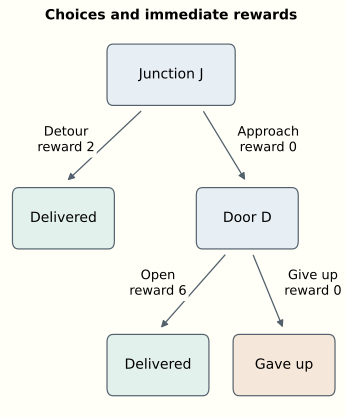

A delivery robot reaches a junction. One route is a long but straightforward detour. The other leads to a closed door. The robot could approach the door, operate its latch, and make the delivery quickly. But if it has not learned to operate the latch, approaching the door may only waste time.

What should learning change? Perhaps the robot should become more willing to approach the door. Perhaps it should first learn what to do when it arrives there. A successful delivery does not come with an annotation assigning credit to every earlier decision. An unsuccessful one does not tell us which decision to replace.

This is the problem of learning from consequences. In reinforcement learning, we specify a reward signal and try to learn behavior that achieves a high expected total reward. The feedback can arrive long after the relevant choice. Moreover, changing the behavior changes which situations the learner encounters and therefore which examples it gets to learn from.

We will develop two connected ideas. **Values** estimate the consequences of choices, including what happens afterward. **Policy gradients** turn sampled experience into a direction for changing the parameters that produce those choices. Along the way, Bellman equations will explain how present and future values fit together, and REINFORCE will explain how a reward can train a neural network without differentiating through the world.

This introduction assumes familiarity with a neural network learning by gradient descent, but no previous reinforcement learning. The numerical examples are deliberately small enough to calculate by hand. The companion essay [“How Does a Policy Improve?”](how-does-a-policy-improve.html) explores planning, probabilistic inference, and recent agents in more depth; this article develops a complete learning method before pointing toward those extensions.

## Actions change the examples we learn from

At each decision, an **agent** selects an action. Its **environment** responds with a new situation and a numerical reward. For the robot, actions might be motor commands or higher-level choices such as approaching a door. Where we draw that boundary depends on the problem we want to study.

A **policy** specifies how actions are selected. We write

$$
\pi_\theta(a\mid s)
$$

for the probability of choosing action $a$ in state $s$, with parameters $\theta$. The vertical bar means “given.” A neural network can take a state description as input and output action probabilities. The parameters are its weights and biases. Sampling from those probabilities turns its output into an action.

The probabilities allow exploration. A robot that always chooses the detour may never collect evidence about opening the door. But randomness alone does not ensure useful exploration: a long sequence of individually plausible random choices can still have an extremely small chance of completing a delivery.

For now, assume the agent can observe the **state**: enough information to predict the distribution of the next reward and state, given an action. This is the Markov assumption. It says that relevant history has been summarized. Position alone would be insufficient if the door's behavior also depends on whether the robot is carrying a key. If a delivery deadline matters, remaining time belongs in the state too.

Real observations can be incomplete. A camera image might hide the latch, and a controller may use a recurrent network to summarize earlier observations. Here we use fully observed states.

Reward expresses what the training procedure is asked to accomplish. It might combine a delivery bonus, time costs, and collision penalties. It is not an instruction identifying the correct action. A move with an immediate cost can make an eventual success possible. Even a seemingly reasonable reward—one that assigns higher scores to better immediate outcomes—can favor undesirable behavior over time. For example, repeatedly collecting a small reward for an intermediate step may yield more total reward than completing the task.

The special difficulty is that actions affect both outcomes and future training data. Choosing the detour produces examples of detours. Choosing the door produces examples of latches. Reinforcement learning can also use previously collected data, including fixed offline datasets; interaction need not happen during every training run. The questions remain whose behavior generated the data and which alternatives it lets us evaluate.

## Returns give delayed consequences a number

A delivery attempt is an **episode**, a sequence that ends in a terminal state. Number actions from $t=0$. Let $r_t$ be the reward received after taking action $a_t$, and let $s_{t+1}$ be the resulting state. If the final action is at $T-1$, the return from time $t$ is

$$
G_t=r_t+\gamma r_{t+1}+\gamma^2r_{t+2}+\cdots+
\gamma^{T-1-t}r_{T-1}.
$$

The **discount factor** $\gamma$ specifies how later rewards count. With $\gamma=1$, we add them without discounting. With $\gamma=0.9$, a reward one decision later has weight $0.9$, and one two decisions later has weight $0.81$. For indefinitely continuing problems, a discount below one also keeps the sum finite when individual rewards are bounded. Discounting is part of the objective we choose, not a fact that the robot discovers.

Discounting sets an **effective time horizon**. For $0\leq\gamma<1$, the weights sum to $1+\gamma+\gamma^2+\cdots=1/(1-\gamma)$. This suggests a characteristic horizon of about 10 decisions for $\gamma=0.9$, 100 for $0.99$, and 1,000 for $0.999$. Importance fades gradually: there is no cutoff at that horizon. The fraction of total discount weight from step $H$ onward is $\gamma^H$; at the characteristic horizon, about a third remains when $\gamma$ is close to one. These are decision counts, so their duration depends on how frequently the agent acts.

Suppose the only reward is a terminal bonus of 1, received $H$ decision intervals from now, so its discount weight is $\gamma^H$. With $\gamma=0.99$, even certain success returns only about $0.366$ at 100 intervals and $0.00657$ at 500. A small expected return can therefore describe reliable but distant success.

If every alternative ends after the same fixed delay and $\gamma>0$, discounting multiplies all expected terminal rewards by the same positive factor and preserves their ranking. Different delays can change the ranking: with $\gamma=0.99$, an 80% chance of reward 1 after 10 intervals is worth about $0.724$, while a 90% chance after 100 is worth $0.329$.

The choice of $\gamma$ thus expresses what success means over time. For bounded-length episodes with only a binary terminal reward, $\gamma=1$ makes expected return equal success probability. Discounting instead favors earlier success. Even when a common multiplier preserves action rankings, smaller learning signals can interact with approximation errors and optimization settings; that is a separate issue from changing the preferred behavior.

Our small environment has two decision states. At the junction $J$, taking the detour finishes the episode with reward $2$. Approaching the door gives reward $0$ and leads to state $D$. At the door, opening it and completing the delivery gives reward $6$; giving up ends with reward $0$. Use $\gamma=0.9$.

The detour therefore returns $2$. Approaching and opening the door returns $0+0.9\times6=5.4$. Approaching and giving up returns $0$. The potentially better route requires a suitable second decision.

Suppose the current policy approaches the door half the time. Once there, it opens it only a quarter of the time. Its average performance depends on the probabilities of all three outcomes: successful opening, giving up, and taking the detour.

## Values evaluate a particular policy

The **state value** $V^\pi(s)$ is the expected return from state $s$ when subsequent actions follow policy $\pi$. “Expected” means averaging over both action choices and any randomness in the environment. In our deterministic delivery environment, only the policy is random.

At the door, our policy gives

$$
V^\pi(D)=0.25\times6+0.75\times0=1.5.
$$

This is the average implied by the current behavior.

The **action value** $Q^\pi(s,a)$ answers a slightly different question: what return do we expect if we take action $a$ now, then follow $\pi$? The superscript records the behavior assumed afterward. The action argument specifies the present choice, even if that choice is unusual for the policy.

The state value averages those action values:

$$
V^\pi(s)=\sum_a\pi(a\mid s)Q^\pi(s,a).
$$

The sum runs over available actions. Multiply each action's value by its probability, then add. At the door, the action values are $6$ and $0$, which reproduces the calculation above.

An action's consequences consist of an immediate reward followed by another situation. That observation gives the **Bellman expectation equation**:

$$
Q^\pi(s,a)=\mathbb E\!\left[r+\gamma V^\pi(s')\mid s,a\right].
$$

Here $s'$ denotes the next state, and a terminal state has value zero. The expectation accounts for possibly different next states and rewards after the same action. For the current policy at our junction,

$$
\begin{aligned}
Q^\pi(J,\text{detour})&=2,\\
Q^\pi(J,\text{door})&=0+0.9\times1.5=1.35.
\end{aligned}
$$

Consequently, $V^\pi(J)=0.5\times2+0.5\times1.35=1.675$.

The door route offers the best possible return, but under the current behavior at the door it is worse than the detour. Improving that later decision changes the value of approaching the door in the first place.

Bellman equations express consistency between values at different states. Computing $V^\pi$ and $Q^\pi$ exactly is practical for small models like ours; in larger problems, we typically approximate them.

## From evaluating behavior to choosing better behavior

Suppose we know the current action values exactly. A natural improvement is to choose the highest-valued action at every state. In our example this gives opening at the door, because $6>0$, and the detour at the junction, because $2>1.35$.

Call that new policy $\pi_1$. Starting at the junction, it obtains $2$, improving on $1.675$. But it still misses the possible return of $5.4$. Its decision to take the detour was based on values that assumed the *old* behavior at the door.

Reevaluate the new policy. Now $V^{\pi_1}(D)=6$, so $Q^{\pi_1}(J,\text{door})=5.4$. A second improvement chooses the door route. The improved downstream behavior has changed which upstream choice is desirable. Notice that evaluating the door action asks a counterfactual question even when $\pi_1$ currently always takes the detour.

This illustrates **policy iteration**: evaluate a policy, improve it using those values, and repeat. With exact evaluation in a finite state and action space and $\gamma<1$, choosing actions greedily with respect to $Q^\pi$ cannot decrease state values. Approximate estimates and shared neural-network parameters complicate that guarantee.

The optimal value functions, written $V^*$ and $Q^*$, assume the best achievable behavior afterward. Their Bellman equations are

$$
\begin{aligned}
V^*(s)&=\max_a Q^*(s,a),\\
Q^*(s,a)&=\mathbb E\!\left[r+\gamma\max_b Q^*(s',b)\mid s,a\right].
\end{aligned}
$$

Compare the first equation with the average defining $V^\pi$. A particular policy distributes its choices according to $\pi$; optimal behavior selects an action with the greatest value. The second equation carries that choice into the future. These **Bellman optimality equations** characterize the values we want to learn.

The expectation and maximum have different jobs. The agent chooses actions. It does not choose which random environmental outcome occurs. If a door sometimes jams, its action value must average over that uncertainty. At the next decision, it can choose an appropriate action for the state it actually observes. The placement of the maximum inside the expectation reflects that opportunity to respond.

**Value iteration** uses this optimality relationship as a repeated update. Start with a table of estimated values, replace each state's value by the best expected immediate reward plus discounted next-state estimate, and repeat. Such a replacement is called a *backup*: information about later outcomes is brought into an earlier estimate.

With all estimates initially zero, one simultaneous sweep in our example assigns value $6$ to the door state and value $2$ to the junction. A second sweep lets the junction use the updated door value and assigns it $5.4$. Reward information has moved backward through the possible decisions. The computation needs a model of their consequences; if we lack one, experience must supply evidence instead. [Sutton and Barto's textbook](http://incompleteideas.net/book/the-book-2nd.html), chapters 3 and 4, develops the expectation and optimality equations and these two iterative methods.

## Learning values from experience

Our calculations used rules we supplied in advance. A learner might instead arrive at the door many times, record what it did, and observe the eventual return. Under a fixed policy, those returns are samples of the quantity $V^\pi(D)$ is meant to predict. Fitting a value estimate to them is an ordinary prediction problem embedded inside the larger control problem.

There is another possibility. After a single transition, we can form a target $r+\gamma\hat V(s')$ using our current estimate of the next state's value. The difference

$$
\delta=r+\gamma\hat V(s')-\hat V(s)
$$

is a **temporal-difference error**. It measures disagreement between the present estimate and the reward-plus-continuation estimate. Learning toward that target is called *bootstrapping*, because one learned estimate helps train another. We can update before the episode finishes, but an inaccurate continuation estimate can mislead us.

Both routes offer useful training signals. Waiting for complete returns gives observed outcomes, which may be noisy and delayed. Bootstrapping makes earlier updates possible, at the price of relying on current predictions. This distinction will matter when a value function starts helping to train a policy.

There is a continuum between these endpoints. We can observe two rewards before bootstrapping, or three, or more. A **$\lambda$-return** mixes targets of different lengths: $\lambda=0$ uses one reward followed by a value estimate, while $\lambda=1$ uses the complete return when the episode terminates. Intermediate values geometrically weight the different horizons. The roles of the two parameters differ: $\gamma$ defines how future rewards count in the objective; $\lambda$ controls how we combine observations and predictions to estimate that objective.

**Eligibility traces** provide a classical way to distribute these corrections online. Visiting a state leaves a decaying trace; a new TD error can then update earlier states that remain eligible. In our delivery example, an unexpectedly successful opening can correct the earlier junction estimate as well as the door estimate during the same episode. With a parameterized value function, traces can instead accumulate the parameter directions involved in recent predictions.

Classical accumulating traces decay by $\gamma\lambda$ per step. A smaller $\lambda$ weakens a later error's direct influence on earlier visits and shifts responsibility to the value estimates used in bootstrapping. Every target in the mixture still estimates the same $\gamma$-discounted return: $\lambda$ changes credit assignment, not the objective's discount factor. Even $\lambda=0$ can propagate distant reward information through successive one-step updates.

With exact continuation values, the targets have the same expectation under the policy being evaluated. With approximate values, choosing $\lambda$ balances variability across sampled trajectories (variance), arising from both action selection and environmental randomness, against the systematic error that inaccurate value estimates used for bootstrapping can introduce (bias). This is the usual bias–variance tradeoff.

The trace remembers past activity so that a later error can act on it. The $\lambda$-return looks forward from an earlier state to combine later outcomes. Their equivalence depends on the precise update rules; changing neural-network parameters during a trajectory requires care. The underlying idea remains useful whether implemented with an explicit trace or by processing stored trajectories. These two views are developed in [chapter 12 of Sutton and Barto](http://incompleteideas.net/book/the-book-2nd.html).

Storing a trajectory to compute its learning targets does not by itself make learning **off-policy**. A **replay buffer** retains experience for reuse across policy updates, often including data from older policies. Learning about a different policy from the one that generated the data is off-policy learning; the update must account for that difference. **Offline RL** means learning from a fixed dataset without collecting new environmental experience during training.

Learning also depends on which experience the robot collects. If it never opens the door, its dataset may contain no example revealing the reward of $6$. A neural network can generalize from related situations, but its prediction about an untried action can be wrong. Exploration determines which predictions the robot gets to test.

## A gradient for a sampled choice

We can learn action values and derive a policy by choosing the highest-valued action, with an exploration rule during training. Q-learning and deep Q-networks follow this approach, without a separately trained policy network. Here we will instead train a parameterized policy directly.

A supervised classifier is trained to increase the probability of a supplied label. Our robot has sampled its own action and received a return. There is no externally supplied correct action to put into the usual classification loss.

We can nevertheless differentiate how its parameters change the probabilities of its choices. Consider just the final decision at the door. Let the probability of opening be

$$
p=\sigma(\theta)=\frac{1}{1+e^{-\theta}},
$$

and let giving up have probability $1-p$. This one-parameter policy is the smallest useful stand-in for a neural network. Its expected reward is $J(\theta)=6\sigma(\theta)=6p$: the dependence on $\theta$ comes through the opening probability $p$. The chain rule gives

$$
\frac{dJ}{d\theta}=6\frac{dp}{d\theta}=6p(1-p).
$$

At $p=0.25$, this derivative is $1.125$. A small increase in $\theta$ raises the opening probability and improves expected reward. We could calculate that directly because we already knew both outcomes. How can an agent estimate it when it only sees the outcome of the action it sampled?

For a network with many parameters, $\nabla_\theta$ collects the derivatives with respect to all of them into a gradient vector. The key identity is $\nabla_\theta\pi_\theta(a)=\pi_\theta(a)\nabla_\theta\log\pi_\theta(a)$. For a finite action set with positive probabilities and fixed mean rewards $\bar r(a)$, it gives

$$
\begin{aligned}
\nabla_\theta\sum_a\pi_\theta(a)\bar r(a)
&=\sum_a\pi_\theta(a)\bar r(a)\nabla_\theta\log\pi_\theta(a)\\
&=\mathbb E_{a\sim\pi_\theta,\,r\mid a}
\left[r\nabla_\theta\log\pi_\theta(a)\right].
\end{aligned}
$$

The last expression is an average over samples from the policy and environment. A sampled reward multiplied by the gradient of the sampled action's log probability is therefore an estimator of the gradient we want. We need to know our own action probabilities; we do not need a derivative of the environmental reward mechanism.

For the sigmoid policy, the log-probability derivatives are $1-p$ for opening and $-p$ for giving up. At $p=0.25$, an opening produces gradient estimate $6\times0.75=4.5$. Giving up produces $0\times(-0.25)=0$. Their probability-weighted average is $0.25\times4.5+0.75\times0=1.125$, exactly the derivative calculated above.

One observation gives either $4.5$ or $0$, not $1.125$. The estimator is **unbiased**: its expectation equals the desired gradient. Individual estimates vary, so a finite learning step can still worsen the policy.

The update is gradient ascent, $\theta\leftarrow\theta+\alpha\hat g$, where $\alpha$ is a positive step size and $\hat g$ is our sampled estimate. Backpropagation computes the log-probability gradient through a larger policy network just as it did through our sigmoid. The sampled action selects which log probability to differentiate; differentiation proceeds through that probability, without passing through the sampling operation.

## From one choice to a complete journey

An episode contains several choices. Changing the first choice changes which later states are reached, so it might seem that we must differentiate the entire environment to account for this. The log-probability calculation offers another route.

For this derivation use episodes of at most $T$ actions and set $\gamma=1$: the objective is expected undiscounted total reward. Pad an early ending with zero-reward terminal transitions if necessary. Write $\tau$ for a trajectory containing states, actions, and rewards. Its probability factors into the initial-state probability, policy action probabilities, and environmental transition-and-reward probabilities:

$$
p_\theta(\tau)=\rho_0(s_0)
\prod_{t=0}^{T-1}\pi_\theta(a_t\mid s_t)
P(s_{t+1},r_t\mid s_t,a_t).
$$

Assume the initial distribution and environmental rules have no direct dependence on $\theta$. For a fixed trajectory, taking a logarithm changes the product to a sum, and differentiating removes the environmental terms. Only the log probabilities of its actions remain.

Recall that $J(\theta)$ is the expected total reward under the policy with parameters $\theta$:

$$
J(\theta)=\mathbb E_{\tau\sim p_\theta}[R(\tau)],
\qquad R(\tau)=\sum_{t=0}^{T-1}r_t.
$$

Applying the same log-probability identity as before gives

$$
\nabla_\theta J(\theta)
=\mathbb E_{\tau\sim p_\theta}
\left[R(\tau)\sum_t\nabla_\theta\log\pi_\theta(a_t\mid s_t)\right].
$$

The environment still determines which trajectories are sampled and what returns they receive. It disappears only from the derivative of a *fixed trajectory's* log probability. Its influence on learning remains in the experience.

We can improve this estimator by giving each action only the rewards that follow it. Earlier rewards have already happened; their expected contribution to that action's log-probability gradient is zero. Keeping them adds needless noise. With $G_t=\sum_{k=t}^{T-1}r_k$, the result is

$$
\nabla_\theta J(\theta)
=\mathbb E_{\tau\sim p_\theta}
\left[\sum_{t=0}^{T-1}G_t\nabla_\theta\log\pi_\theta(a_t\mid s_t)\right].
$$

This is the episodic **REINFORCE** estimator using return from each decision onward. For the discounted objective $\mathbb E[\sum_t\gamma^t r_t]$, the corresponding expression uses discounted $G_t$ and an additional factor $\gamma^t$ on each term.

REINFORCE belongs to the family developed by [Ronald Williams](https://doi.org/10.1007/BF00992696). The important computational fact is that sampled outcomes can train a differentiable probability distribution even when obtaining those outcomes involves discrete choices and unknown environmental dynamics.

## Better than expected is more informative than positive

Raw returns can give noisy guidance. A sampled action may be followed by a lucky event it did not cause. Some states offer large returns almost regardless of the current choice. We would like the update to emphasize what is unusually good or bad about this choice in this situation.

Subtract a **baseline** $b(s)$ from the return. For a fixed state, the expected log-probability gradient is zero:

$$
\sum_a\pi_\theta(a\mid s)\nabla_\theta\log\pi_\theta(a\mid s)
=\nabla_\theta\sum_a\pi_\theta(a\mid s)
=0.
$$

The probabilities sum to one, and the derivative of one is zero. Multiplying by a baseline that does not depend on the sampled action preserves this cancellation. We can therefore replace $G_t$ by $G_t-b(s_t)$ without changing the expected policy gradient. A well-chosen baseline reduces its variance.

Return to the one-step door decision. Its expected reward is $1.5$, so use that as the baseline. Opening now has weight $6-1.5=4.5$ and gradient estimate $4.5\times0.75=3.375$. Giving up has weight $0-1.5=-1.5$ and gradient estimate $(-1.5)\times(-0.25)=0.375$.

Both observations now increase the opening parameter. A successful opening favors opening; giving up discourages giving up. The expected estimate is still $0.25\times3.375+0.75\times0.375=1.125$. Its variability is lower: the two possible estimates are closer together. The baseline has changed how information is extracted from each outcome while preserving the mean update direction.

The distinction between absolute reward and comparative quality matters. If two actions always returned $5$ and $6$, both would have positive raw weights. A baseline between them would give the worse choice a negative weight. “Increase good actions and decrease bad ones” becomes more precise when good means better than the appropriate expectation.

The natural state-dependent baseline is an estimate of $V^\pi(s)$. This connects policy gradients to the values we introduced earlier. The **advantage** is

$$
A^\pi(s,a)=Q^\pi(s,a)-V^\pi(s).
$$

It measures how an action compares with the policy's average at that state. A sampled $G_t-\hat V(s_t)$ estimates that comparative quality, subject to trajectory variability and errors in the value estimate.

A second network can learn the baseline by predicting returns. Subtract its prediction from the sampled return to obtain the policy update's weight. Do not differentiate through this weight; the policy gradient comes from the log probability. Update the policy using the baseline's existing predictions, then train the baseline on that batch's returns with its own regression objective.

## A training loop we can actually carry out

The pieces now specify a complete procedure. Keep the policy and baseline parameters unchanged while collecting a batch of episodes. Continuing with $\gamma=1$, compute returns backward: the last return is the last reward, and each earlier return is its reward plus the next return. Subtract the baseline predictions and accumulate the weighted log-probability gradients. Average the sums over episodes, take one policy update, then fit the baseline to the observed returns.

A gradient-descent implementation can use the following scalar expression for a batch of $N$ episodes:

$$
L_{\text{policy}}(\theta)
=-\frac1N\sum_{i=1}^N\sum_t
\operatorname{stopgrad}(G_{i,t}-b(s_{i,t}))
\log\pi_\theta(a_{i,t}\mid s_{i,t}).
$$

Here $\operatorname{stopgrad}$ tells backpropagation to treat that factor as data and compute no derivatives through it. The minus sign converts gradient ascent on expected return into gradient descent on this training expression. Summing within episodes and averaging across them matches our objective of expected total reward per episode.

This batch is **on-policy**: all episodes come from the policy whose gradient we are estimating. After the update, reusing it to train the new policy would be **off-policy**. Repeatedly optimizing the same expression on old episodes no longer has the unbiased-gradient interpretation we just derived.

The scalar training expression is also not a performance measurement. Its gradient has the desired meaning at the sampling policy, but its numerical value is not expected return. Evaluate new behavior in the environment to find out whether performance improved. [Spinning Up's policy-optimization tutorial](https://spinningup.openai.com/en/latest/spinningup/rl_intro3.html) develops this distinction and supplies an implementation.

Rare successes remain difficult. If every sampled attempt returns zero, a zero baseline gives no learning signal. More informative rewards, better exploration, demonstrations, or prior learning may be needed to discover how to open the door.

## What values and policy gradients make possible

In an **actor–critic** method, a policy—the actor—uses a learned value function—the critic—to help estimate the consequences of its choices. The critic can supply temporal-difference errors as learning weights, allowing policy updates before an episode finishes. This connects Bellman reasoning directly to policy gradients through bootstrapping.

**Generalized advantage estimation**, or GAE, brings the $\lambda$ idea into policy-gradient learning. Allowing discounting again, and holding the value estimates fixed over a complete episode, it combines TD errors as

$$
\begin{aligned}
\hat A_t^{\mathrm{GAE}}
&=\sum_{k=0}^{T-t-1}(\gamma\lambda)^k\delta_{t+k},\\
\delta_t&=r_t+\gamma\hat V(s_{t+1})-\hat V(s_t).
\end{aligned}
$$

At $\lambda=0$, only the immediate TD error remains. At $\lambda=1$, with zero terminal value, the intermediate value terms cancel, leaving discounted return minus $\hat V(s_t)$. Intermediate settings trade reliance on longer sampled outcomes against reliance on the critic, with the bias–variance tradeoff discussed earlier. The [GAE paper](https://arxiv.org/abs/1506.02438) develops this connection to TD($\lambda$); [PPO implementations such as CleanRL](https://github.com/vwxyzjn/cleanrl/blob/master/cleanrl/ppo.py) compute it from collected trajectories. Eligibility traces' underlying idea remains part of contemporary policy optimization.

Planning offers another source of information. With a model of what actions do, the robot can compare simulated futures before acting. Value estimates can summarize what lies beyond a short planning horizon. Conversely, the results of planning can supply targets for a policy, letting it learn to make useful choices more cheaply later.

**Distributional RL** learns the distribution of possible returns, allowing us to ask about variability as well as averages. We can still train the policy to maximize expected return, or use a risk-sensitive objective that favors reliable outcomes. This does not itself replace discounting: timing and risk are different preferences. Nor is outcome variability the same as uncertainty that exploration can reduce. A familiar door that randomly jams may remain unpredictable after many trials; an unfamiliar but reliable latch may become predictable once tested. Exploration can target useful gaps in knowledge even when the eventual policy should avoid unreliable outcomes.

Another possibility is to make a desired return an input to the policy. **Upside-down RL** trains on recorded actions labeled with the returns and time horizons they actually achieved, then requests desirable outcomes when choosing new actions. The core essay develops [this connection between return distributions, exploration, and return-conditioned policies](how-does-a-policy-improve.html#from-return-distributions-to-return-conditioned-policies), including why imitating lucky outcomes need not reproduce their rewards.

Language-model training supplies a different environment for related ideas. A prompt and the tokens already generated form the context for the next token choice. A completed response can receive a reward from a test, a rule, or a learned evaluator. Policy-gradient methods can then change the probabilities of the sampled token choices.

Practical methods also try to reuse samples without moving the policy too far from the behavior that generated them. [PPO](https://arxiv.org/abs/1707.06347) uses a surrogate objective with probability ratios and clipping. Clipping changes the incentive to keep increasing or decreasing a sampled action's probability; it is not a hard bound on the resulting policy change. [GRPO](https://arxiv.org/html/2402.03300v3#S4.SS1) uses comparisons among responses to the same prompt to construct its learning weights, avoiding a separately learned value model in its original formulation.

At the robot's first junction, evaluating its current policy tells us why approaching the door may be a poor choice today. Bellman optimality identifies the better coordinated behavior it could achieve. Experience supplies evidence about outcomes, and policy gradients translate that evidence into parameter updates. A baseline puts each outcome in context by comparing it with the policy's usual expectation.

Useful learning carries these improvements into subsequent decisions, including situations the robot has not encountered in exactly the same form. The reward supplies a criterion for comparing outcomes; the policy gradient turns sampled experience into a way to train the network that chooses actions.

The companion [“How Does a Policy Improve?”](how-does-a-policy-improve.html) takes these foundations into planning, world models, and the relationship between policy improvement and probabilistic inference. For a systematic textbook treatment, [Sutton and Barto](http://incompleteideas.net/book/the-book-2nd.html) develop the foundational concepts in chapters 3–4, learning values from experience in chapters 5–6, and policy gradients in chapter 13.
