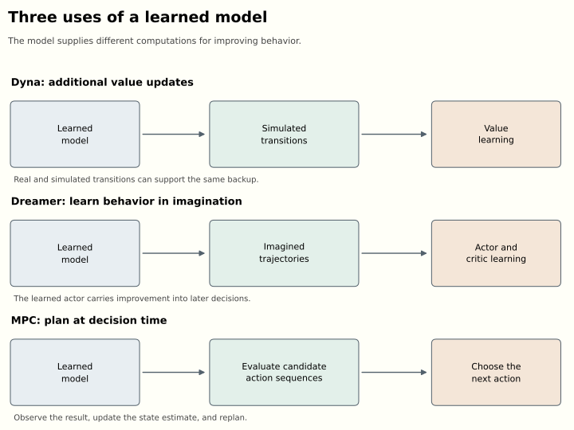
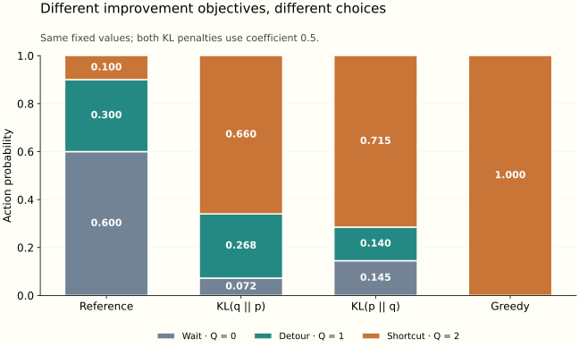

*For an introduction to policies, Bellman equations, and learning from rewards, start with the companion [“How Can a Reward Train a Neural Network?”](how-can-a-reward-train-a-neural-network.html). This essay develops the connections to planning and probabilistic inference; both articles can be read independently.*

An agent reaches a junction. Its instinct is to take the route that looks familiar, but it has time to consider alternatives. It can consult a map, simulate several journeys, recall which choices worked previously, or ask a learned value function to score its options. After this extra work it chooses differently. If the choice succeeds, there is something worth retaining: next time, perhaps the agent can make the better decision without repeating the entire deliberation.

This movement between deliberation and learned behavior connects several families of reinforcement-learning algorithms. A planner can improve the decision available at one state. A policy can absorb the planner's decisions into a function that generalizes across states. A learned model can supply additional experience, support search, or provide gradients for training that policy. Probabilistic inference gives another description of improvement: start from a distribution over behavior, condition it toward desirable outcomes, and fit a policy to the resulting distribution.

My old slides on model-based reinforcement learning and probabilistic policy improvement approached these ideas from different directions. Revisiting them several years later, the connections seem more useful than a catalogue of algorithms. They also lead somewhere current. Dreamer 4 combines learning inside a world model with a preference-based descendant of Maximum a Posteriori Policy Optimisation, or MPO. The mathematical machinery connecting these topics is still doing practical work.

The earlier essay [“Which World Model?”](which-world-model.html) asked what a model represents and how reliably an agent uses it. Here the question is more operational: given experience, predictions, and an objective, how do we obtain a better policy? We will follow that question from Bellman equations through planning, the evidence lower bound, expectation-maximization, and weighted regression, before returning to recent agents. The examples and derivations use a common notation rather than reproducing each paper's conventions.

## Evaluating a policy and improving it

Consider a discounted Markov decision process. At state $s$, the agent samples an action $a$ from its policy $\pi(a\mid s)$. The environment supplies a reward and a next state according to its dynamics. Write $r(s,a)$ for the expected immediate reward, $P(s'\mid s,a)$ for the transition probabilities, and $\gamma\in[0,1)$ for the discount factor. States summarize what is needed to predict the next transition; they need not be directly visible to the agent.

The return is the discounted sum of rewards. Two functions summarize its expectation:

$$
\begin{aligned}
V^\pi(s)&=\mathbb E_\pi\!\left[\sum_{t=0}^{\infty}\gamma^t r_t\mid s_0=s\right],\\
Q^\pi(s,a)&=r(s,a)+\gamma\sum_{s'}P(s'\mid s,a)V^\pi(s').
\end{aligned}
$$

The superscript matters. $Q^\pi(s,a)$ evaluates taking action $a$ now and following $\pi$ afterward. It does not assume that all subsequent decisions are optimal. The state value averages over the policy's present choice:

$$
V^\pi(s)=\sum_a\pi(a\mid s)Q^\pi(s,a).
$$

The advantage $A^\pi(s,a)=Q^\pi(s,a)-V^\pi(s)$ measures how much better an action is than the current policy's average at that state. Its policy-weighted mean is zero. A positive advantage is consequently a comparative judgment, not a claim that the action receives a positive immediate reward.

For a recurring example, imagine a delivery robot deciding whether to wait, take a detour, or use a shortcut. At the junction state $s$, suppose its current action probabilities and correctly evaluated action values, in that order, are

$$
\pi_0(\cdot\mid s)=(0.6,0.3,0.1),\qquad Q^{\pi_0}(s,\cdot)=(0,1,2).
$$

These numbers summarize complete journeys, including the current behavior after reaching a gate on the shortcut. They are not a specification of all the underlying transitions. The value at the junction is $0.5$, so the advantages are $(-0.5,0.5,1.5)$. The robot spends most of its probability on its worst option, perhaps because earlier training rewarded caution or because the shortcut was only recently discovered.

With exact values and an unrestricted table of action probabilities, improvement is easy: put all the probability on the largest $Q$. The policy-improvement argument explains why this local operation has a global consequence. If a new policy $\pi'$ satisfies

$$
\sum_a\pi'(a\mid s)Q^\pi(s,a)\geq V^\pi(s)
\quad\text{for every }s,
$$

then applying its Bellman operator repeatedly propagates that inequality forward. Monotonicity and contraction give $V^{\pi'}\geq V^\pi$. Policy iteration alternates evaluation and improvement; value iteration interleaves them through an optimality backup. These are the classical foundations developed in [Sutton and Barto, chapters 4 and 8](http://incompleteideas.net/book/the-book-2nd.html).

Practical agents complicate every clause of the argument. Values are estimated from incomplete experience. A neural policy shares parameters across states, so improving one output may damage another. The states used for training may differ from those visited by the new policy. And an apparent shortcut may exploit a defect in the model rather than a feature of the environment. The exact theorem is useful precisely because it makes these departures visible.

There is a second useful identity. Let $J(\pi)$ be expected return from a fixed initial-state distribution and define normalized discounted occupancy

$$
d^\pi(s)=(1-\gamma)\sum_{t\geq0}\gamma^t\Pr_\pi(s_t=s).
$$

Then

$$
J(\pi')-J(\pi)=\frac{1}{1-\gamma}
\mathbb E_{s\sim d^{\pi'},\,a\sim\pi'}[A^\pi(s,a)].
$$

To see why, expand each advantage as expected reward plus discounted next-state value minus present-state value. Along a trajectory the value terms telescope. The initial value subtracts $J(\pi)$; the remaining rewards give $J(\pi')$. Bounded values make the distant discounted remainder vanish.

The difficulty is that the expectation uses states visited by the *new* policy. We usually have data from the old one. Replacing $d^{\pi'}$ by $d^\pi$ gives a manageable surrogate, but it is an approximation whose quality depends on how behavior changes. Trust regions acquire a concrete purpose here: they help make the data distribution relevant to the policy we are about to deploy. [Kakade and Langford's conservative policy iteration](https://people.eecs.berkeley.edu/~pabbeel/cs287-fa09/readings/KakadeLangford-icml2002.pdf) and [TRPO](https://arxiv.org/abs/1502.05477) develop this line of reasoning.

## The different jobs of a world model

A dynamics model estimates what follows an action. It may predict a next physical state, a distribution over images, or a latent representation sufficient for some control problem. Calling an algorithm model-based tells us that such a model participates in learning or decision-making. It leaves open what computation the model performs.

In **Dyna**, actual experience both updates a value function and trains a model. The model then supplies additional transitions for further value updates. A tabular Q-learning update has the familiar form

$$
Q(s,a)\leftarrow Q(s,a)+\alpha\left[r+\gamma\max_b Q(s',b)-Q(s,a)\right].
$$

The same update can consume an observed transition or a simulated one. In the delivery example, discovering that a gate is open can support many additional backups through routes that reach it. The agent need not physically repeat every route before updating its estimates. Classical Dyna-Q does not require inserting simulated transitions into a replay buffer; it can update directly from model samples. The important distinction is where the transition came from.

Model-generated data offers cheap computation, but not independent evidence. Repeating an incorrect simulated transition a million times does not establish that the gate is open. It establishes that the value learner has thoroughly absorbed the model's belief. This distinction between computational reuse and new information will remain important throughout the essay.

[SimPLe](https://arxiv.org/abs/1903.00374) scales the simulated-experience idea to Atari. It alternates collecting real experience, learning a video-prediction model, and training a policy in that learned environment. A short simulated rollout can supply useful training signal while limiting the damage from accumulated prediction error. Predicting pixels is nevertheless expensive: a large part of an image may be irrelevant to deciding whether a passage is traversable.

Latent models reduce that burden. Given observations $o_t$ and actions, an encoder constructs an internal state $z_t$. During training it can use the new observation to infer that state; during imagination a transition model must predict without seeing the future observation:

$$
\begin{aligned}
z_t&\sim q_\phi(z_t\mid z_{t-1},a_{t-1},o_t),\\
z_{t+1}&\sim p_\phi(z_{t+1}\mid z_t,a_t).
\end{aligned}
$$

Here $z$ can include deterministic recurrent memory as well as stochastic variables. In a partially observed environment, that memory is essential. The robot may have to remember a sign seen before reaching the junction. Two identical current camera images need not imply the same situation.

The original [Dreamer](https://arxiv.org/abs/1912.01603) learns an actor and a value function from imagined latent trajectories. Its continuous-control actor receives gradients through predicted actions, transitions, rewards, and values. Continuous random variables can be expressed as differentiable transformations of parameter-independent noise, enabling reparameterization gradients. Straight-through estimators enter for discrete choices; they are not a universal description of all gradients through Dreamer's model.

A finite imagination horizon is extended by a learned terminal value. One schematic objective is

$$
\mathbb E\!\left[\sum_{t=0}^{H-1}\gamma^t\hat r(z_t,a_t)
+\gamma^H\hat V(z_H)\right].
$$

This puts a demanding responsibility on the critic. A short imagined path to the gate is useful only if its terminal value reflects what can happen beyond the gate. A model error and a value error can reinforce each other, even when neither looks dramatic in isolation.

Dreamer's actor eventually produces actions without running a fresh trajectory search at every decision. The computational work of improving behavior has been partly absorbed into its parameters. This is sometimes called *amortization*: paying a training cost so that repeated decisions become cheaper. It does not mean eliminating the model, which can still maintain the current latent state, and it does not guarantee that the cheap action matches what a planner with more time would choose.

There is already an ELBO in this story, but it concerns **learning the world model**. For a generic latent-variable model, variational inference gives

$$
\log p_\phi(o)\geq
\mathbb E_{q_\psi(z\mid o)}[\log p_\phi(o\mid z)]
-D_{\mathrm{KL}}(q_\psi(z\mid o)\|p_\phi(z)).
$$

The approximate posterior explains observations through latent variables. Reconstruction rewards explanatory fit; the KL term relates inferred latents to a predictive prior. Sequential models have a corresponding sum of observation and transition terms. [Variational autoencoders](https://arxiv.org/abs/1312.6114) supply the basic construction. Later we will use the same variational identity for a different purpose: explaining *desirable behavior*. A world-model ELBO and a control ELBO optimize different distributions against different evidence.

The third use of a model is direct planning. The robot can retain its model as a tool for deciding what to do now. This makes additional computation available at deployment, at the price of having to finish that computation before the next action is due.

## Planning over trajectories and trees

Model-predictive control, or MPC, repeatedly solves a finite-horizon problem. From the current estimated state, propose action sequences, predict their consequences, score their returns, and execute the first action of the selected sequence. After a new observation arrives, solve the problem again. The remaining planned actions are provisional.

This distinction matters at the gate. A sequence saying “approach, pass through, turn left” should not remain binding after the robot sees that the gate is closed. Replanning uses the new evidence. It cannot retroactively repair a collision, but it prevents the entire predicted future from becoming a fixed commitment.

Random shooting samples candidate sequences and keeps the best. The cross-entropy method iteratively fits a proposal distribution to an elite set of high-scoring candidates. Another common pattern weights candidates exponentially:

$$
w_k=\frac{\exp(\hat G_k/\eta)}{\sum_j\exp(\hat G_j/\eta)},
\qquad \bar a_t=\sum_k w_k a_t^{(k)}.
$$

Here $\hat G_k$ is predicted return for candidate $k$. Small $\eta$ concentrates weight on the apparent winners. Path-integral control supplies a more specific derivation for related updates under assumptions about dynamics, noise, and control costs. The displayed weighting pattern alone does not make every such planner an instance of the same path-integral algorithm; proposal corrections and cost terms matter. [Williams et al.](https://arxiv.org/abs/1509.01149) develop a path-integral MPC construction.

There is also a geometric problem with averaging. If one good route passes left of an obstacle and another passes right, their average may head straight into it. An expressive distribution over plans can preserve alternatives that a single mean collapses. Selecting, mixing, and fitting candidate actions are different operations even when their scores are identical.

[PETS](https://arxiv.org/abs/1805.12114) combines probabilistic dynamics ensembles with trajectory sampling and MPC. Individual predictive distributions represent stochasticity; differences between learned ensemble members help represent uncertainty about the dynamics. These are different reasons for uncertainty: a gate can open randomly even when its mechanism is known, or the agent can simply lack enough observations to know how it works. An ensemble is a practical estimator, not a certificate that all important uncertainty has been captured.

[MBOP](https://arxiv.org/abs/2008.05556) adds an especially useful arrangement for offline data. It learns dynamics, a behavioral prior for proposing plausible actions, and a return model for extending the planning horizon. Its planner combines these ingredients at decision time. The training is offline because the models are learned from a fixed dataset; planning is still performed online in the sense of choosing actions during execution. “Offline planning” and “offline RL” should therefore never be treated as interchangeable labels without explaining the intended meaning.

Tree search organizes computation differently. Several candidate journeys may share an initial action, then branch after different observations or choices. A tree can reuse evaluations of shared prefixes and allocate more computation to promising or uncertain branches. Monte Carlo tree search typically repeats selection, expansion, evaluation, and backup. In a stochastic environment the transition outcomes also need appropriate treatment; action branches alone do not express all uncertainty.

AlphaZero combines a known game model with a network that predicts action priors and a state value. Search refines decisions; its visit distribution supplies a policy-training target, while outcomes train the value prediction. Its leaf evaluation uses the network rather than requiring the random rollout to the end of a game familiar from earlier MCTS descriptions. The learned prior, search allocation, and learned value cooperate. [Silver et al.](https://arxiv.org/abs/1712.01815) describe the resulting self-play system.

MuZero learns the model used inside the search. Its representation function maps observation history to a latent state, its dynamics function predicts a next latent and reward, and its prediction function produces policy and value outputs. Training asks these unrolled predictions to agree with rewards, value targets, and search policies. It does not require the latent state to reconstruct every pixel. A useful internal model can therefore be trained around quantities needed for decisions. [Schrittwieser et al.](https://arxiv.org/abs/1911.08265).

That economy has a boundary. Predicting task-relevant quantities under the training distribution does not establish that a representation preserves every intervention relevant to a new task. A map recording which corridors lead to deliveries might omit wall materials needed for a later demolition task. “Sufficient for control” always invites the question: sufficient for which rewards, actions, and situations?

The more recent [TD-MPC2](https://arxiv.org/abs/2310.16828) develops this economy for continuous control. It learns latent transitions, rewards, and values without reconstructing observations, then performs local trajectory optimization with a terminal value estimate. The paper reports one hyperparameter configuration across 104 tasks and, separately, a single 317-million-parameter agent trained across 80 tasks. The first demonstrates algorithmic robustness; the second demonstrates joint multitask learning. They are different achievements.

We now have several ways to spend computation before acting. But what exactly makes the resulting action distribution an improvement, and how should it become a training target? To answer that, it helps to temporarily put trajectories aside and solve a problem at a single state.

## Improving a distribution without throwing away the prior

Fix a state and suppress it from the notation. Let $p(a)$ be a reference policy with positive probabilities and let $Q(a)$ be a fixed vector of action values. We seek an improved distribution $q$. For finite actions, the KL divergence is

$$
D_{\mathrm{KL}}(q\|p)=\sum_a q(a)\log\frac{q(a)}{p(a)}.
$$

It measures a directional discrepancy between distributions. It is nonnegative, vanishes when they agree, and is generally asymmetric. If $p(a)=0$, assigning positive mass to that action gives infinite $D_{\mathrm{KL}}(q\|p)$. Regularization toward a prior can preserve useful experience, but it cannot conjure alternatives outside that prior's support.

Consider the penalized objective

$$
F(q)=\sum_a q(a)Q(a)-\eta D_{\mathrm{KL}}(q\|p),
\qquad \eta>0.
$$

The first term favors good actions; the second charges for departing from the reference. Enforce $\sum_aq(a)=1$ with multiplier $c$. Setting the derivative to zero gives

$$
Q(a)-\eta\left(\log\frac{q(a)}{p(a)}+1\right)-c=0.
$$

Exponentiation and normalization yield

$$
q^*(a)=\frac{p(a)e^{Q(a)/\eta}}{Z},
\qquad Z=\sum_b p(b)e^{Q(b)/\eta}.
$$

This is a softmax of $\log p(a)+Q(a)/\eta$, not generally a softmax of values alone. The distinction disappears only for a uniform reference. A rare action needs a sufficient value advantage to overcome its small prior probability. As $\eta$ grows, the update approaches the reference; as it shrinks, probability concentrates on the largest supported values.

There is an illuminating way to verify both the optimum and its meaning. Substitute the expression for $q^*$ into the KL divergence to obtain

$$
F(q)=\eta\log Z-\eta D_{\mathrm{KL}}(q\|q^*).
$$

Everything depending on $q$ is now a negative divergence. This proves that $q^*$ maximizes the objective and identifies the optimum as $\eta\log Z$. It also anticipates the ELBO: a log normalization constant equals a variational objective plus a nonnegative gap.

For the robot, take $p=(0.6,0.3,0.1)$, $Q=(0,1,2)$, and $\eta=0.5$. The unnormalized weights are approximately $(0.6,2.217,5.460)$, giving

$$
q^*\approx(0.0725,0.2678,0.6597).
$$

The expected value under these fixed scores rises from $0.5$ to approximately $1.587$. Greedy improvement would reach $2$, but it would discard both alternatives entirely. The regularized update retains them. These are local expectations under the stated values; an inaccurate critic or a bad fit of the policy can invalidate their interpretation as actual performance gains.

Instead of choosing $\eta$, we can specify a budget $\epsilon$:

$$
\max_q\mathbb E_q[Q]
\quad\text{subject to}\quad D_{\mathrm{KL}}(q\|p)\leq\epsilon.
$$

The Lagrangian multiplier becomes the temperature, obtained by minimizing

$$
g(\eta)=\eta\epsilon+
\eta\log\sum_a p(a)e^{Q(a)/\eta}.
$$

At a differentiable interior solution, $g'(\eta)=\epsilon-D_{\mathrm{KL}}(q_\eta\|p)$. Thus the optimization adjusts temperature until the update uses the allowed divergence. If the unconstrained best action already fits within the budget, the constraint can be inactive and the limiting temperature can be zero. “Using a hard constraint” therefore does not mean avoiding Lagrange multipliers; it means choosing the multiplier through the constraint rather than treating it as a fixed penalty coefficient.

## The evidence lower bound and expectation maximization

The same reweighting can be derived as inference. Start with a policy $\pi_\theta$ and its finite-horizon trajectory distribution

$$
p_\theta(\tau)=\rho_0(s_0)
\prod_{t=0}^{T-1}\pi_\theta(a_t\mid s_t)P(s_{t+1}\mid s_t,a_t).
$$

For this derivation take rewards as a fixed function of state and action, and let $R(\tau)$ be the trajectory's total return. Random rewards can be included by adding their environment factors to both trajectory distributions below. Introduce an auxiliary binary observation $O$ whose likelihood favors high-return trajectories. If returns are bounded above by $C$, one valid construction is

$$
p(O=1\mid\tau)=\exp\!\left(\frac{R(\tau)-C}{\alpha}\right),
\qquad \alpha>0.
$$

The bound ensures a likelihood no greater than one. $O$ is a modeling device: we choose a relationship between desirability and likelihood. It need not name an independently observed physical event, and it should not be mistaken for proof that a trajectory is optimal.

Introduce an auxiliary distribution $q(\tau)$. Jensen's inequality gives

$$
\begin{aligned}
\log p_\theta(O=1)
&=\log\mathbb E_q\!\left[
\frac{p_\theta(\tau)p(O=1\mid\tau)}{q(\tau)}\right]\\
&\geq\mathbb E_q[\log p(O=1\mid\tau)]
-D_{\mathrm{KL}}(q\|p_\theta).
\end{aligned}
$$

The right side is the **evidence lower bound**, or ELBO, which we will call $\mathcal L(q,\theta)$. Its exact gap is

$$
\log p_\theta(O=1)-\mathcal L(q,\theta)
=D_{\mathrm{KL}}\!\left(q(\tau)\|p_\theta(\tau\mid O=1)\right).
$$

The bound becomes tight when $q$ equals the posterior over trajectories conditioned on the desirable event. With our exponential likelihood, multiplying the ELBO by $\alpha$ gives, up to the constant $-C$,

$$
\mathbb E_q[R(\tau)]-\alpha D_{\mathrm{KL}}(q(\tau)\|p_\theta(\tau)).
$$

The familiar return-minus-divergence objective has appeared as a variational bound. This is the central mathematical connection in the [control-as-inference literature](https://arxiv.org/abs/1805.00909), and it motivates MPO's use of alternating optimization.

In exact expectation-maximization, the **E-step** fixes $\theta$ and computes the posterior $q$. The **M-step** fixes $q$ and adjusts $\theta$ to increase the bound. Since the environment dynamics and initial-state distribution do not depend on policy parameters, the policy-dependent part of that step is

$$
\max_\theta\mathbb E_{\tau\sim q}
\left[\sum_t\log\pi_\theta(a_t\mid s_t)\right].
$$

It is a supervised-learning objective, except that the distribution supplying the targets was constructed to favor good behavior. “Expectation” does not mean merely taking an average reward, and “maximization” does not mean taking a greedy action. The E-step determines latent responsibilities or posterior weights; the M-step fits parameters using those weights.

Why does exact EM improve the evidence? At the old parameters, the E-step makes the bound equal the evidence. The M-step raises that bound. At the new parameters the evidence is at least as high as the new bound, so it cannot have decreased. If the E-step is restricted or approximate, the starting bound need not be tight. Increasing a loose bound alone does not establish the same evidence-monotonicity result. Sampling error and incomplete neural optimization add further qualifications.

There are two more distinctions we should keep explicit. First,

$$
\alpha\log\mathbb E_{p_\theta}[e^{R/\alpha}]
\neq\mathbb E_{p_\theta}[R]
$$

in general. The left side is sensitive to the distribution of returns, not only its mean. For large $\alpha$ its expansion begins with the mean plus $\operatorname{Var}(R)/(2\alpha)$. Unrestricted conditioning can favor a risky lottery because its lucky outcomes receive enormous weight. Casting a problem as inference therefore requires inspecting which objective the probabilistic construction actually optimizes.

Second, an arbitrary trajectory posterior can change the apparent dynamics. Among journeys conditioned on success, the shortcut gate may appear open far more often than it opens in the real environment. The robot controls its actions, not the gate's random mechanism. A posterior that quietly makes the gate more cooperative is not a feasible policy.

We can impose that feasibility by restricting the auxiliary distribution to

$$
q(\tau)=\rho_0(s_0)
\prod_t q(a_t\mid s_t)P(s_{t+1}\mid s_t,a_t).
$$

The environment factors now cancel inside the log ratio, leaving

$$
D_{\mathrm{KL}}(q(\tau)\|p_\theta(\tau))
=\mathbb E_{\tau\sim q}\sum_t
D_{\mathrm{KL}}\!\left(q(\cdot\mid s_t)\|\pi_\theta(\cdot\mid s_t)\right).
$$

This restricted ELBO is a feasible regularized control objective. Its optimizer generally does not equal the unrestricted posterior. It must account for expected consequences under the given transitions. In our gate example, it can prefer approaching the gate, inspecting it, or retreating; it cannot assign itself more favorable gate dynamics.

This also clarifies the relationship to maximum-entropy RL. Against a uniform action reference, the negative policy KL contributes policy entropy plus a constant. Against a nonuniform reference, it rewards staying near that particular behavior. Entropy regularization, regularization toward a pretrained policy, and regularization toward the last policy iterate have different practical meanings even when their algebra is closely related. [Soft Actor-Critic](https://arxiv.org/abs/1801.01290) is an important development of the entropy-regularized branch.

## REPS and the consistency of state distributions

Relative Entropy Policy Search, or [REPS](https://ojs.aaai.org/index.php/AAAI/article/view/7727), predates MPO and reaches exponential reweighting through a constrained optimization problem. Its original continuing-task formulation is particularly instructive because it constrains a joint state-action distribution, not just actions at independently fixed states.

For this paragraph switch from discounted returns to stationary average reward. Let $\nu(s,a)$ be the candidate occupancy and $\mu(s,a)$ the reference data distribution. In addition to normalization and a KL budget, the candidate must satisfy flow conservation:

$$
\sum_a\nu(s',a)
=\sum_{s,a}\nu(s,a)P(s'\mid s,a).
$$

Incoming probability equals the state's marginal probability. Otherwise optimization could put all its mass at the delivery destination without paying for the journeys needed to arrive there.

Attach multipliers $V(s)$ to these constraints. The coefficient of each $\nu(s,a)$ in the Lagrangian contains

$$
\delta_V(s,a)=r(s,a)+\sum_{s'}P(s'\mid s,a)V(s')-V(s).
$$

Maximizing over $\nu$ then yields

$$
\nu^*(s,a)\propto\mu(s,a)e^{\delta_V(s,a)/\eta}.
$$

The multipliers are optimized along with temperature so that the candidate respects the constraints. Conditionalizing $\nu^*$ gives a policy. With feature-based flow constraints this becomes an approximation. The important lesson is structural: value-like quantities can arise as prices enforcing consistency between states. Simply reweighting arbitrary transitions by high rewards would omit that consistency.

## MPO separates improvement from fitting

[Maximum a Posteriori Policy Optimisation](https://arxiv.org/html/1806.06920) combines the inference perspective with an off-policy critic and a practical separation between a flexible improvement distribution and a parameterized policy. In its nonparametric E-step, states are drawn from a fixed sampling distribution $\mu$, and actions are evaluated using a critic for the current policy $\pi_i$.

The constrained problem is

$$
\begin{aligned}
\max_q\quad&\mathbb E_{s\sim\mu,\,a\sim q}[Q^{\pi_i}(s,a)]\\
\text{subject to}\quad&
\mathbb E_{s\sim\mu}
[D_{\mathrm{KL}}(q(\cdot\mid s)\|\pi_i(\cdot\mid s))]\leq\epsilon.
\end{aligned}
$$

Its solution has the form already derived, with a shared temperature determined by the dual. The average constraint does not require every state to use the same KL distance. Some states can change more than others while respecting the common budget.

In a continuous action space, the algorithm samples several candidate actions from $\pi_i$ at each sampled state. Their empirical weights are proportional to exponentiated critic values. The reference-policy factor is represented by the sampling procedure; multiplying every sampled weight by the policy density again would generally count that factor twice. This distinction between a density formula and a Monte Carlo estimator is small on paper and consequential in code.

The M-step fits a policy by weighted likelihood, with an additional trust-region constraint:

$$
\max_\theta\mathbb E_{s\sim\mu,\,a\sim q_i}
[\log\pi_\theta(a\mid s)].
$$

In the paper, the additional constraint controls movement from the old parameterized policy toward the new one; Gaussian implementations can constrain mean and covariance changes separately. The nonparametric distribution can express an improved target before the neural policy commits to how that target should generalize. The critic's fitting objective is a separate part of the algorithm.

The “maximum a posteriori” in MPO's name refers to a prior over policy parameters. Adding $\log p(\theta)$ to the inference objective turns the M-step into weighted likelihood plus a parameter-prior term. The paper connects a suitable local prior to a KL penalty on changes in the policy, then uses a constrained version in practice. This parameter prior and the reference action distribution play related but distinct roles: the reference shapes the improved target, while the additional M-step regularization controls how the fitted policy moves toward it.

This separation explains what MPO contributes to the larger story. We need not demand that one gradient step in policy parameters simultaneously discover good actions, preserve sensible exploration, and represent the improved behavior. We can first construct a better distribution using estimated values, then solve a supervised fitting problem. The quality of the estimate and the quality of the fit remain distinct responsibilities.

For the delivery robot, an E-step can give the shortcut two-thirds of the local probability even if the actor cannot yet represent that preference consistently across visual scenes. A successful M-step learns what distinguishes this junction from other junctions. A poor one memorizes a background texture or pushes all similar scenes toward the shortcut. The likelihood objective tells us what target to fit; it does not guarantee that the representation or dataset supplies the distinctions needed to fit it well.

## Weighted regression and learning from a fixed dataset

[Advantage-Weighted Regression](https://arxiv.org/abs/1910.00177), or AWR, makes policy extraction look particularly simple. Estimate returns for observed state-action pairs, fit a value baseline, and train the policy with likelihood weights determined by advantage. Its practical actor objective has the form

$$
\max_\theta\mathbb E_{(s,a)\sim\mathcal D}
\left[e^{\hat A(s,a)/\beta}\log\pi_\theta(a\mid s)\right].
$$

The reference behavior is represented by the actions in the dataset. Those can come from several earlier policies stored in a replay buffer. Unlike MPO's usual nonparametric improvement step, AWR need not sample a fresh set of candidate actions from the current policy at every training state. It reweights the recorded choices using their estimated quality.

The appeal is practical as well as conceptual. A value regression and a weighted policy regression are familiar learning problems. Their combination can reuse older experience. Yet several qualifications hide behind the compact equation: the quality of return estimates, the interpretation of a baseline under a mixture of behavior policies, the temperature, and the clipping of large weights.

Our earlier normalized solution helps expose a subtlety. At a fixed state, replacing $Q(s,a)$ by $A(s,a)=Q(s,a)-V(s)$ changes every unnormalized action weight by the same factor. That factor cancels in the conditional distribution:

$$
\frac{p(a\mid s)e^{(Q(s,a)-V(s))/\beta}}
{\sum_b p(b\mid s)e^{(Q(s,b)-V(s))/\beta}}
=\frac{p(a\mid s)e^{Q(s,a)/\beta}}
{\sum_b p(b\mid s)e^{Q(s,b)/\beta}}.
$$

Why, then, does the baseline matter in weighted regression? Because fitting one network across states is a different optimization from normalizing each state's distribution separately. Dropping state-dependent partition functions changes the relative contribution of different states. Subtracting $V(s)$ likewise rescales all the examples from that state. Weight clipping can further break the cancellation. A baseline can therefore be irrelevant to an exact conditional optimizer and important to the practical approximation used to train shared parameters.

Here is an original numerical illustration. Imagine two junctions with the same action preferences, but every journey from the second receives an additional reward of 100. Exponentiating raw returns makes that junction dominate a dataset-wide regression objective. Subtracting each junction's baseline removes the common reward offset. The intended conditional choices remain the same; the allocation of the learner's finite capacity changes. This is why algebra about normalized policies should not be transferred casually to unnormalized sample losses.

Offline RL makes another issue unavoidable. The dataset may contain very little evidence about a promising action. Maximizing an unconstrained learned critic can select that action precisely because its estimate is wrong. The resulting policy then moves into regions where the error becomes worse.

[Implicit Q-Learning](https://arxiv.org/abs/2110.06169), or IQL, avoids querying unseen actions in its value-learning updates. It fits an upper expectile of observed action values and backs that value up through dataset transitions. The expectile loss for residual $u$ is

$$
\ell_\tau(u)=|\tau-\mathbf1\{u<0\}|u^2,
\qquad \tfrac12<\tau<1.
$$

Positive residuals receive more weight, pulling the fitted state value above the conditional mean. A separate policy is then extracted through advantage-weighted behavioral cloning. This provides multi-step value propagation while keeping critic queries tied to dataset actions; it does not certify that every action generated by a fitted neural actor will remain inside the data's support.

The broader lesson is that learning a value function and extracting a policy need not be interleaved in exactly the same way. We can improve value estimates using one set of constraints, then ask a separate regression procedure to express useful behavior. Success still depends on the compatibility of those two stages.

## From return distributions to return-conditioned policies

Weighted regression raises a question that an expected value leaves unanswered: did an action reliably produce a good outcome, or occasionally get lucky? **Distributional RL** learns the distribution of the random return $Z^\pi(s,a)$, whose mean is $Q^\pi(s,a)$. Its policy-evaluation relation is

$$
Z^\pi(s,a)\overset{d}{=}r+\gamma Z^\pi(s',a'),
\qquad a'\sim\pi(\cdot\mid s').
$$

Equality here means equality in distribution, sampling reward and successor state from the environment and continuation return from the corresponding conditional distribution. Remaining time belongs in the state for a finite-horizon problem. [Bellemare, Dabney, and Munos](https://arxiv.org/abs/1707.06887) develop this perspective and a practical distributional learning algorithm. Learning a distribution does not require changing the objective: action selection can still maximize its mean.

The additional information also supports **risk-sensitive control**. For example, $\mathbb E[G]-\beta\operatorname{Var}(G)$, with $\beta>0$, penalizes variable returns; lower-tail criteria instead emphasize bad outcomes. These are preferences over the return distribution, separate from the temporal preference expressed by $\gamma$. Both routes to a certain reward of 1 have identical undiscounted return distributions even if one takes ten times longer. Modeling risk alone cannot express urgency. For bounded-length episodes, undiscounted returns are well defined; for continuing tasks, average-reward RL offers a different objective, long-run reward per step. [Distributional extensions to average-reward learning](https://arxiv.org/abs/2506.03333) now exist too. The [distributional RL textbook](https://www.distributional-rl.org/contents/chapter7) develops risk criteria and why optimizing them can require more than ordinary greedy Bellman updates.

Risk aversion need not prohibit exploration. A gate with a well-known chance of jamming has **aleatoric uncertainty**, variability in outcomes. An unfamiliar mechanism whose reliability we have not established introduces **epistemic uncertainty**, uncertainty in our knowledge. An experiment can reduce the latter and help us find reliable behavior. Distributional estimates alone do not generally separate the two. [Mavrin and colleagues](https://proceedings.mlr.press/v97/mavrin19a.html) use upper return quantiles to construct an exploration bonus and decay its influence to avoid persistently chasing inherent randomness. [Antonov and Dayan](https://rlj.cs.umass.edu/2024/papers/Paper122.html) investigate Bayesian distributional learning for exploration. Optimism about what an action might teach us and a preference for reliable eventual outcomes can coexist.

There is another use for outcome information: make it an input. **Upside-down RL** learns a policy $\pi_\theta(a\mid s,g,h)$ conditioned on a desired return $g$ and remaining horizon $h$. A recorded segment that earned $g$ over $h$ steps supplies a supervised example: predict its first action from its starting state and those achieved quantities. Even a disappointing journey can teach how a particular outcome was obtained. During interaction, the agent receives a desired command; the remaining reward request and time budget are updated as the journey proceeds. [Srivastava and colleagues](https://arxiv.org/abs/1912.02877) develop this approach, introduced alongside [Schmidhuber's proposal](https://arxiv.org/abs/1912.02875). Choosing useful commands and collecting informative experience remain necessary parts of learning.

[Decision Transformer](https://arxiv.org/abs/2106.01345) applies the related idea to sequence modeling, predicting actions from desired return-to-go and trajectory context using a transformer. These methods can train action prediction directly, without first fitting a distributional critic. The progression from predicting outcomes to conditioning on outcomes is a conceptual connection, rather than a required sequence of algorithms. A time budget can also express a command's temporal scope explicitly, while discounting defines how rewards contribute to a scalar objective.

We can make the connection to weighted regression precise. For the following derivation, fix a segment horizon and suppress it in the notation. Let $p_{\mathcal D}(a,g\mid s)$ denote the experience distribution and $\pi_{\mathcal D}(a\mid s)$ its action marginal. Bayes' rule gives

$$
p_{\mathcal D}(a\mid s,G=g)
\propto\pi_{\mathcal D}(a\mid s)\,
p_{\mathcal D}(G=g\mid s,a).
$$

For continuous returns, interpret these as conditional densities where defined. A return-conditioned policy fits the left-hand conditional directly. A distributional predictor models the outcome term on the right. Both reflect the continuation behavior represented in the data; neither automatically describes what an improved policy will achieve.

More generally, assign a nonnegative desirability weight $w(g)$ to recorded returns. Reweighting the joint distribution and marginalizing the return gives

$$
q_w(a\mid s)=
\frac{\pi_{\mathcal D}(a\mid s)\,
\mathbb E_{\mathcal D}[w(G)\mid s,a]}
{\sum_b\pi_{\mathcal D}(b\mid s)\,
\mathbb E_{\mathcal D}[w(G)\mid s,b]}.
$$

Assume a finite positive normalizer; replace the sum by an integral for continuous actions. An indicator weight selects a desired return range. An exponential weight softly favors larger returns and recovers the form of the desirability likelihood in our ELBO construction. This derivation describes a reweighted data distribution, not a policy-improvement guarantee.

The order of operations matters:

$$
\mathbb E_{\mathcal D}[e^{G/\eta}\mid s,a]
\ne
e^{\mathbb E_{\mathcal D}[G\mid s,a]/\eta}
\quad\text{in general},\qquad \eta>0.
$$

MPO's critic-based improvement exponentiates an estimated expected action value. Exponentially weighting individual sampled returns instead produces the left-hand quantity in the population limit. This distinction also matters when interpreting AWR's sampled advantage estimates: subtracting a fixed state baseline does not remove outcome variability before exponentiation. Clipping and other estimation choices further change the practical weights.

For an original one-step example, compare a certain reward of 2 with a lottery paying 10 with probability $0.1$ and zero otherwise. Their means are 2 and 1. With equal action priors and $\eta=1$, exponentiating the means favors the certain reward; weighting realized returns exponentially favors the lottery because $0.9+0.1e^{10}>e^2$. Conditioning on return 10 selects only lottery actions. Playing those actions again leaves the winning probability at $0.1$.

This is the earlier ELBO feasibility issue in a new form: conditioning can select favorable environmental outcomes that a policy cannot cause. Return-conditioned learning offers a useful supervised representation of behavior, but requesting a high return does not establish that it is controllable. The quality of the experience, the attainable commands, and the treatment of stochastic outcomes determine whether the fitted behavior improves.

## Search as regularized policy improvement

We can now return to the connection noted in the old slides: AlphaZero's search constructs a nonparametric action distribution which the network learns to imitate. The resemblance to MPO is substantive, but the objectives differ.

[Grill and colleagues](https://proceedings.mlr.press/v119/grill20a.html) analyze a regularized objective of the form

$$
\max_q\left[\sum_a q(a)Q(a)
-\lambda D_{\mathrm{KL}}(p\|q)\right].
$$

Here $p$ is the policy prior and $Q$ denotes search estimates. The KL arguments are reversed relative to our exponential update. Differentiating with a normalization multiplier $c$ gives

$$
Q(a)+\lambda\frac{p(a)}{q(a)}-c=0,
\qquad
q^*(a)=\frac{\lambda p(a)}{c-Q(a)},
$$

where $c>\max_a Q(a)$ is chosen so the probabilities sum to one. This is a rational expression, not an exponential one.

For the same robot and coefficient $\lambda=0.5$, normalization gives $c\approx2.06994$ and

$$
q^*\approx(0.1449,0.1402,0.7149).
$$

The two KL directions produce different compromises. Equal numerical penalty coefficients do not imply equal divergence budgets, so the comparison is illustrative rather than a claim that one update is intrinsically better.

The search connection appears when we examine a PUCT-style action-selection score:

$$
Q(s,a)+c_{\mathrm{puct}}p(a\mid s)
\frac{\sqrt{\sum_bN(s,b)}}{1+N(s,a)}.
$$

Grill et al. introduce the smoothed visit distribution

$$
\hat\pi(a\mid s)=\frac{1+N(s,a)}{|\mathcal A|+\sum_bN(s,b)}.
$$

The exploration term can then be expressed using $p/\hat\pi$, the same ratio appearing in the derivative of the regularized objective. Their analysis relates search allocation to progress toward its optimizer. The extra count per action facilitates that analysis; it should not be silently identified with every implementation's final visit-count target. During actual search, values and counts both evolve, so a finite search is not simply an exact solve for one fixed vector of values.

[Gumbel AlphaZero and Gumbel MuZero](https://openreview.net/pdf?id=bERaNdoegnO), published at ICLR 2022, address the limited-budget case directly. If search visits only a few root actions, ordinary visit-count training may fail to improve the policy. The Gumbel methods sample actions without replacement and organize selection and policy targets around an improvement construction, with particularly useful results when few simulations are available.

This sharpens what it means for search to teach a policy. A target does not become good merely because it cost computation to obtain. The search must explore relevant alternatives, evaluate them well, and turn those evaluations into a distribution that deserves to be learned. An actor trained on poor search can efficiently reproduce poor search.

The EM comparison now has a precise scope. Both procedures can alternate constructing a better distribution and fitting a policy. MPO motivates its distribution through variational inference and a KL-constrained critic objective. AlphaZero obtains its target through tree search, with a related regularized-optimization interpretation. This shared structure does not make AlphaZero's ordinary training loop exact EM on MPO's trajectory ELBO.

## Where imitation rewards enter

So far the agent has had a reward function. Demonstrations pose a different question: if we know how an expert behaves but lack a satisfactory reward, can we construct a signal that encourages similar behavior?

The [PWIL paper](https://arxiv.org/html/2006.04678) uses a primal optimal-transport construction. Represent an agent trajectory by the empirical distribution of its state-action pairs and demonstrations by another empirical distribution. If there are $T$ agent points and $D$ expert points, a coupling $\Gamma$ obeys

$$
\sum_j\Gamma_{ij}=\frac1T,
\qquad
\sum_i\Gamma_{ij}=\frac1D,
\qquad\Gamma_{ij}\geq0.
$$

It describes how probability mass is matched between the two empirical distributions. The transport objective minimizes $\sum_{ij}\Gamma_{ij}d(x_i,y_j)$. My slides used squared costs, corresponding to a different Wasserstein order; the revised paper develops the first-order case. The coupling is a joint probability distribution with specified marginals. For rectangular matrices with these normalized sums, the usual term “doubly stochastic matrix” is imprecise.

PWIL greedily matches arriving agent points to remaining demonstration mass and turns transport costs into rewards. This can be used with an RL algorithm; it supplies the objective rather than replacing policy improvement. A feasible greedy coupling gives an upper bound on optimal transport cost, but nonlinear conversion of step costs into positive rewards does not make maximizing their sum exactly identical to minimizing that cost.

The mass constraint adds something absent from a nearest-neighbor reward. Suppose the demonstrations contain equal amounts of waiting and delivery. A robot that waits forever cannot keep matching every waiting point to the same unlimited reservoir of expert waiting. That mass gets used up. The construction compares how behavior is distributed, not only whether each isolated point has a similar expert example.

It still needs an appropriate distance. If visual background dominates the representation, nearby state-action points may be behaviorally unrelated. Conversely, an abstract representation may identify distinct actions whose consequences differ. Optimal transport respects the geometry it is given; it does not establish that the geometry captures the task.

Trajectory length matters too. With mass $1/T$ per arriving point, the reward mechanism needs a horizon convention and tracks how much expert mass remains. Variable termination, padding, and rewards after mass exhaustion affect incentives. These details must be checked in an implementation; a fixed-horizon derivation alone does not determine variable-length behavior. The reward is also history-dependent through remaining mass; it is not simply one fixed function of the current physical state and action unless that bookkeeping is included in the state.

This detour helps distinguish several uses of “matching distributions.” PWIL matches empirical behavior to demonstrations geometrically. MPO fits a policy to a critic-improved distribution. A world-model posterior matches latent explanations to observations. All three use probability, but the distributions live in different spaces and serve different purposes.

## From relative entropy to preference learning

Language-model preference training provides another application of the exponential optimizer. Treat a prompt as a context $x$ and an entire response as an action $y$. For a reward $r(x,y)$ and reference $\pi_{\mathrm{ref}}$, the KL-regularized optimum satisfies

$$
\pi^*(y\mid x)=\frac{\pi_{\mathrm{ref}}(y\mid x)e^{r(x,y)/\beta}}{Z(x)}.
$$

Rearrange it:

$$
r(x,y)=\beta\log\frac{\pi^*(y\mid x)}{\pi_{\mathrm{ref}}(y\mid x)}
+\beta\log Z(x).
$$

Under the Bradley–Terry preference model, the probability of preferring response $y_+$ to $y_-$ is the logistic sigmoid of their reward difference. Substituting the rearranged expression cancels the context-dependent partition term. [Direct Preference Optimization](https://arxiv.org/abs/2305.18290), or DPO, consequently trains policy log-ratios using a classification loss on preference pairs.

This is a direct mathematical reuse of the reward-to-policy relation. It does not alternate an explicit E-step with an M-step, and its pairwise preference assumptions deserve separate examination. Two completions can both be bad while one is preferred; an absolute label calling a completion unacceptable supplies different information. We should therefore distinguish comparisons from positive and negative labels, even if both can guide learning.

The distinction becomes central in [“Learning from Negative Feedback, or Positive Feedback or Both”](https://arxiv.org/abs/2410.04166), published at ICLR 2025. Its preference-based MPO, or PMPO, extends the inference approach to accepted and rejected examples that need not be paired. Its positive-feedback derivation explicitly uses an ELBO and EM. The negative-feedback construction shows how a likelihood-decreasing term can be combined with a reference-policy penalty.

We can see the underlying identity without committing to a particular implementation. At one context, let $p(y)$ be the reference and $u(y)\in[0,1]$ the probability that output $y$ is accepted. Conditioning gives

$$
q_+(y)=\frac{p(y)u(y)}{Z_+},
\qquad Z_+=\mathbb E_p[u(y)].
$$

Assume $Z_+>0$, so that conditioning is defined. The corresponding fitting objective increases likelihood under $q_+$. If acceptance is a binary label, rejected samples have zero weight in that expression. They disappear from the explicit regression target, although probability normalization still couples all outputs.

Now use $u(y)=1-(1-u(y))$:

$$
\begin{aligned}
\mathbb E_p[u\log\pi_\theta]
&=\mathbb E_p[\log\pi_\theta]
-\mathbb E_p[(1-u)\log\pi_\theta]\\
&=-D_{\mathrm{KL}}(p\|\pi_\theta)
-\mathbb E_p[(1-u)\log\pi_\theta]+\text{constant}.
\end{aligned}
$$

This is an algebraic view of the same positive-feedback numerator through rejection information and a reference distribution. The normalization factors and sampling conventions determine its exact scaling. In practical objectives those scalings can become tunable coefficients; the result should not automatically inherit every guarantee of the exact identity.

The regularizer is especially important when decreasing likelihood. A naked objective $-\log\pi_\theta(y_-)$ can grow without bound by driving a rejected example's probability toward zero, without specifying a sensible replacement. A reference provides structure to what remains. On the robot example, suppressing waiting should not arbitrarily make driving into a wall probable simply because wall collisions were never labeled.

KL-regularized policy improvement embodies a lesson related to the representation-learning discussion in [“Which World Model?”](which-world-model.html). There, Mattick agrees with LeCun that pulling similar examples together and pushing others apart insufficiently constrains a useful representation; he favors adding structure through a reference distribution. Here, encouraging accepted behavior and discouraging rejected behavior is supplemented by a distribution over plausible actions. In representation learning, the reference shapes the geometry of embeddings. In policy learning, it shapes how probability can be redistributed among behaviors. The common design principle is to combine selective feedback with structure over the space in which learning takes place.

[GRPO's original formulation](https://arxiv.org/html/2402.03300v3#S4.SS1) illustrates how relative feedback and regularization can coexist. It compares rewards within a group of responses to the same prompt to construct advantage weights, while a separate KL penalty discourages departure from a reference policy. The group supplies a comparison among sampled responses; the reference supplies a broader behavioral constraint. These are complementary roles. GRPO's relative weighting acts on response probabilities, whereas contrastive representation learning acts on embedding similarities.

There is a useful connection to the earlier distinction between knowing good behavior and knowing which bad behavior to avoid. Success-only imitation copies what happened to work. Negative feedback can exclude mistakes while leaving several plausible alternatives. This is valuable when successful demonstrations are scarce, provided the prior contains useful alternatives and the rejection labels are informative. Regularization cannot repair an utterly unsuitable prior by itself.

## Recent agents bring the constructions together

[DreamerV3](https://doi.org/10.1038/s41586-025-08744-2), first released in 2023 and published in Nature in 2025, makes robustness across tasks a central achievement. Normalization, balanced losses, and suitable output representations allow the same configuration to work across more than 150 tasks. “One configuration” describes reusable algorithm settings; it does not mean one trained policy jointly mastered every benchmark. Its learning from imagined experience follows the broad organization introduced earlier, while many details differ from the first Dreamer.

That result matters because practical RL is sensitive to scale. The units of a reward should not determine whether the actor's optimization becomes numerically unstable. Nor should a small change in the magnitude of value targets force an entirely new tuning exercise. Mathematical objectives can be equivalent under rescaling while their finite-precision optimization procedures behave very differently. Robust learning machinery is part of making a general recipe reusable.

[Dreamer 4](https://arxiv.org/abs/2509.24527), introduced in September 2025, learns a transformer world model using a shortcut-forcing objective, then improves behavior inside it. Its Minecraft experiment uses about 2,500 hours of recorded gameplay with actions and event annotations. The policy learns through a PMPO variant using advantage signs and a behavioral prior; its KL direction differs from the original PMPO formulation. With intermediate task prompts, the reported agent obtains diamonds in 0.7% of 1,000 evaluation episodes. The result demonstrates offline improvement through imagination, with substantial limitations; it is not reliable autonomous completion of the whole task. The task-conditioned setup also differs from DreamerV3's online-learning experiment. [Paper, sections 3.3 and 4.1](https://arxiv.org/html/2509.24527v1).

The interesting connection for this essay is architectural. The world model provides counterfactual experience; a critic judges consequences; a policy-improvement objective translates those judgments into changes in action probabilities. We can ask separately whether the simulated experience is faithful, whether the values are correct, whether the preference signal is useful, and whether the actor represents the resulting distribution. A successful whole system depends on all four, but an observed failure need not indict all four.

Consider again the gate. If the model hallucinates an opening, the critic may correctly evaluate the hallucinated world. If the model predicts the closure accurately but the critic assigns a large terminal value to waiting there, the fault is downstream. If both predictions are sound but the fitting objective puts too little weight on the rare closed-gate examples, the actor may fail anyway. Finally, an actor could behave correctly from the wrong latent state because perception has mistaken which junction it occupies. The decomposition gives us places to investigate.

The 2026 preprint [POCO](https://arxiv.org/abs/2604.01860) illustrates another extension. It applies posterior-guided improvement to policies generating chunks of actions, with an implicit E-step over sampled candidates and a clipped regression surrogate for fitting expressive generative policies. Such policies can be easy to sample from while expensive to evaluate as exact likelihoods. The paper is relevant as an emerging direction, rather than an established endpoint of this account.

One technical question becomes particularly important there: a supervised generative loss or a bound on negative log likelihood is not automatically the likelihood itself. Replacing a log-probability ratio by a difference of surrogate losses requires additional justification. An EM motivation can remain useful while exact EM guarantees cease to apply. The distinctions developed above let us read such proposals sympathetically without treating every step from an ELBO to an implemented loss as an identity.

## What constrains improvement when the estimates are wrong

An optimizer amplifies whatever distinctions its objective rewards. If the estimated shortcut value is 20 because the model mistakenly removes a wall, reducing temperature makes the policy more confidently wrong. More search can expose the mistake if it gathers relevant information, but more search within the same erroneous simulator can intensify it.

An original toy calculation makes the point. Suppose the true values remain $(0,1,2)$, but the critic mistakenly scores waiting as 5, giving estimated values $(5,1,2)$. With the previous reference and temperature $0.5$, exponential reweighting assigns almost all probability to waiting. Its true expected value falls below the reference's $0.5$, even though its estimated regularized objective improves. The local optimization is functioning exactly as specified. What fails is the premise that its scores measure the desired consequences.

A policy KL constraint limits the size of a step relative to its reference. It does not calibrate the critic, constrain every future state equally, or ensure that the reference itself is appropriate. Repeating small steps can also produce a large total departure. A constraint against the last iterate has a different effect from a persistent constraint against the dataset behavior or a frozen pretrained policy.

Horizon limits address a different source of error. Short rollouts reduce the number of opportunities for dynamics errors to accumulate. But they transfer responsibility to terminal values, and they may miss effects that the critic has not learned. There is no horizon that is best independently of model quality, value quality, and task structure. A nearby gate with an uncertain long-term consequence can be harder than a long predictable corridor.

Uncertainty estimates can help choose where to trust a model. Ideally they distinguish irreducible environmental randomness from ignorance that more data could reduce. An ensemble may reveal disagreement about the gate mechanism. If every member inherited the same blind spot from the dataset, agreement provides less reassurance. Predictive uncertainty is useful only insofar as it tracks the errors that matter for control.

[MOReL](https://arxiv.org/abs/2005.05951) turns this concern into pessimistic model-based offline RL. Its constructed MDP routes state-action pairs judged unknown into a low-reward absorbing state. Planning in that model discourages exploiting unsupported regions. Its theoretical lower-bound interpretation depends on assumptions about the model and the unknown-region detector; a practical ensemble heuristic does not automatically satisfy them.

Pessimism has an opportunity cost. The real shortcut may be excellent, yet remain inaccessible to an agent that has no trustworthy evidence about it and no permission to collect more. This is a limitation of the information available, not necessarily a failure to optimize aggressively enough. Offline improvement can recombine and generalize from experience, but it cannot universally resolve differences between environments that the data leave indistinguishable.

We should also distinguish statistical support from physical validity. A behavioral prior can keep action proposals near demonstrated motions, but the same motion can be inappropriate in a changed state. Conversely, a novel action may be physically valid even though the dataset contains nothing similar. Support constraints manage one kind of uncertainty; dynamics knowledge and task constraints manage others. Combining them is often reasonable because none is a substitute for all the rest.

This is where the apparently abstract choice of divergence becomes operational. Penalizing $D_{\mathrm{KL}}(q\|p)$ forbids mass outside the exact support of $p$. Penalizing $D_{\mathrm{KL}}(p\|q)$ instead forbids deleting mass where $p$ is positive. With a neural Gaussian these hard boundaries are softened by full support, and finite-sample estimation introduces further approximations. Statements such as “the KL keeps us in distribution” need to specify both the direction and the distributions being compared.

The final safeguard is evaluation against what the model was meant to represent. Imagined return, critic loss, likelihood fit, and environment return are separate measurements. A convincing experiment should make clear which improves, what data were available, and which parts of the system were held fixed. Otherwise a gain attributed to planning might come from more training data, and a gain attributed to a world model might come from a stronger representation used only for behavioral cloning.

## A reusable way to read the algorithms

The algorithms we have discussed differ in how they answer four questions: where do candidates come from, how are they evaluated, how is an improved distribution constructed, and how is that improvement retained?

| Method | Candidates and evaluation | How improvement is retained |
|---|---|---|
| Dyna | Model transitions support additional value backups | Updated values guide later actions |
| MPC | Proposed action sequences receive model-based return estimates | A plan guides the next action; replanning follows |
| Dreamer | An actor generates imagined trajectories, evaluated using rewards and values | Actor parameters absorb improvement |
| AlphaZero and MuZero | Tree search allocates evaluations using priors and value estimates | Search targets train the policy network |
| MPO | Current-policy action samples receive critic scores | A constrained distribution is fitted by weighted likelihood |
| AWR and IQL | Dataset actions receive estimated advantage weights | Weighted regression extracts an actor |
| PMPO | Outputs receive acceptance or rejection information | Likelihood terms and a reference penalty update the policy |

The table is a map of roles, not a claim that every row instantiates one theorem. Dyna can improve a value function without an explicit supervised policy projection. MPC can act without retaining a fitted actor. A model can be trained by a variational objective while its actor uses policy gradients. The common questions remain useful even when the answers differ.

For a new paper, I would first locate the actual distributions. Is the reference the current actor, an old behavior mixture, a frozen model, or an empirical search distribution? Does the candidate range over single actions, chunks, complete trajectories, or occupancies? Which quantities are treated as fixed during the update? These details often explain more than the algorithm's name.

Next I would mark the exact equalities and the approximations. The exponential tilt is an exact finite-action optimizer under stated assumptions. Replacing values with a neural critic is an approximation. Sampling a few candidates adds another. Omitting a state-dependent normalizer changes a shared-parameter regression objective. Reversing a KL changes its optimizer. Replacing likelihood with a generative surrogate changes what can be inferred from an EM argument. Each step may be sensible, but it deserves its own reason.

Finally I would ask where new information enters. Search in a known model can discover consequences that have not yet been computed. Imagination in a learned model can make experience more computationally useful. A new observation can correct the model. These are complementary contributions. Confusing them makes it easy to mistake repeated internal calculation for stronger empirical evidence.

The robot at the junction needs all of them in the right proportions. It needs enough knowledge to distinguish a route from an imagined shortcut, enough computation to compare consequences, and enough learning to carry a useful decision into the next encounter. A policy improves when that chain preserves what makes its choices better. The equations help us construct the chain, and also show where it can break.

## Reading paths

For the foundations, start with [Sutton and Barto](http://incompleteideas.net/book/the-book-2nd.html), especially policy iteration and planning, then [Levine's control-as-inference tutorial](https://arxiv.org/abs/1805.00909). For the central derivations, read [REPS](https://ojs.aaai.org/index.php/AAAI/article/view/7727), [MPO](https://arxiv.org/abs/1806.06920), and [AWR](https://arxiv.org/abs/1910.00177), paying attention to occupancy constraints, sampling distributions, and policy projection.

For the planning connection, follow [MuZero](https://arxiv.org/abs/1911.08265), [MCTS as regularized policy optimization](https://proceedings.mlr.press/v119/grill20a.html), and [Gumbel policy improvement](https://openreview.net/pdf?id=bERaNdoegnO). For the more recent convergence of ideas, compare [TD-MPC2](https://arxiv.org/abs/2310.16828), [PMPO](https://arxiv.org/abs/2410.04166), and [Dreamer 4](https://arxiv.org/abs/2509.24527). The papers linked throughout the essay give the other branches. The discussion covers work available by October 1, 2026; POCO is included as a preprint outlook.
